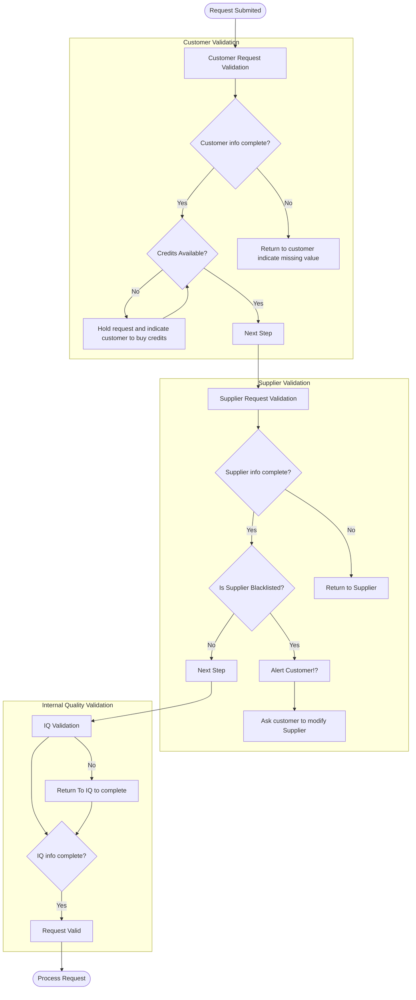

# Qualyfize Verification and Analytics System

The following code process incoming requests ingested through an API using a csv file containing the information of each one.

## Requirements
- Code is written in Go Lang.
- API functions:
 - Load file
- If any rule is not accomplished a warning must be rised
- Every processing should be logged to console

## Classes
There are 3 classes of objects:
- Customer: Is the generator of each request. Ask for an Audit from the Suppliers.
- Supplier: Is the Audit executor, information contained is: Site, address, contact, availability.
- InternalQA: Is the internal owner of the audit process, information contained is: Owner, Checklist, Flag

## Verification Logic Flow
The following is a Mermaid Flowchart of the validation process

