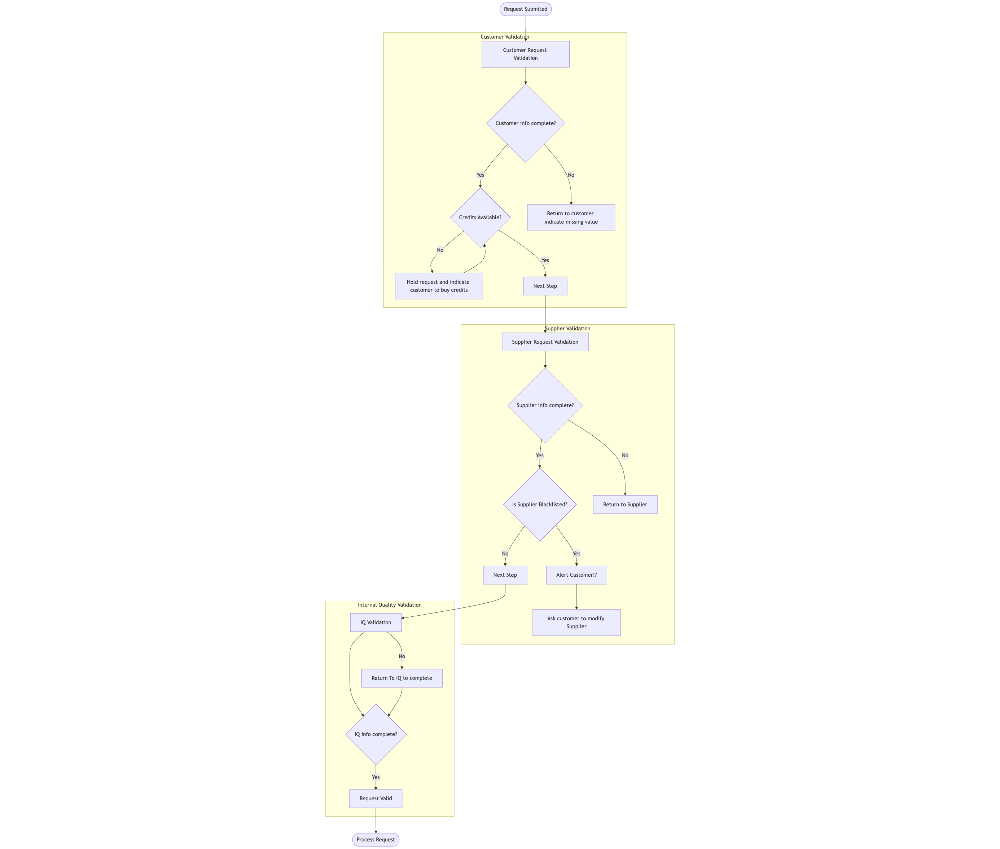
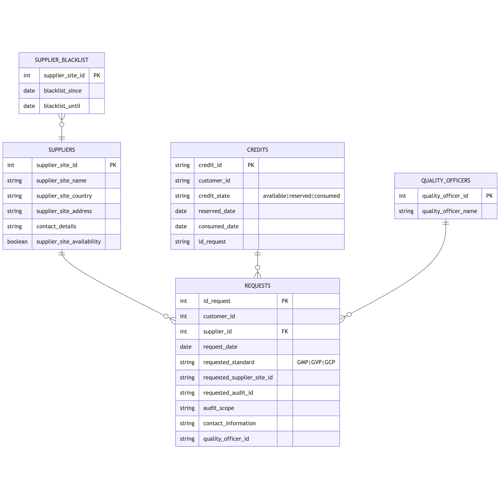
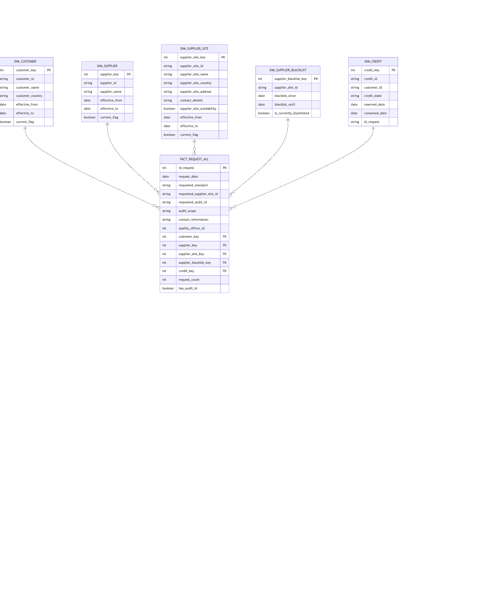

# Qualifyze Case Study

Welcome to my proposal of the validation and analysis system to process audits requests.
On this document you will find the steps I walk thorough to understand, analyze, design and implement the given test.

The document contains 4 sections:
- **Assumptions**: Contains my understanding of the process and the reflections made upon it.
- **Requirements**: It's a small version of a PDR.
- **Design**: Contains text and diagrams for the architecture definition, as well as recommendations for production systems.
- **Improvements**: Ideas that came to my mind during this process.

---

## 1. Assumptions
- 1.1. The CSV files are a similar approximation to a OLTP system
- 1.2. The customer request must be accepted even if the information is not complete and the validation must be done afterwards.
- 1.3. The ER proposal is focused on the OLAP system for observability.

## 2. Requirements
### Problem statement

Audit request process needs to be fast and efficient, at the same time is key to be non-blocking so that if not all information is available at first, a placeholder can be stored for future completion.

### Users

- **Customers**: life-science companies needing an audit process
- **Suppliers**: Quality and Audit Consulting firms that provide audit process to Customers.
- **Internal Quality**: Internal owners of the process that verify the correct execution of each audit.

### Functional Requirements

- **Validation workflow**: The system shall automatically validate each audit request for completeness across three stakeholder inputs: customers (who/where/when, requested standard: GMP/GVP/GCP, contact, scope), suppliers (legal entity/site, address, contact, availability), and internal quality (assigned quality owner, applicable checklist per standard, risk/feasibility flag). Requests failing validation shall be flagged and prevented from progressing to scheduling.

- **Credits accounting**: The system shall compute required credits based on audit standard with rules GMP=1×, GVP=2×, GCP=4×, verify the customer wallet balance, and upon confirmation reserve the computed credits; insufficient balance shall block progression and notify the customer.

- **Supplier blacklist check**: The system shall automatically cross-check supplier/site against a maintained blacklist and mark the request as not feasible if found; blocked requests shall not proceed and shall log the reason.

### Non-Functional Requirements

- **Auditability and traceability**: The system shall provide a visual interface to track each request through the validation funnel with time-stamped status changes, inputs used (requests, suppliers, blacklist, credits, quality officers), and decision outcomes for compliance and internal review.

- **Performance and scalability**: The validation process shall execute in near real-time for interactive UI feedback and scale to handle increasing audit volumes without degrading throughput, supporting concurrent validations safely.

- **Security and data integrity**: The system shall enforce role-based access to stakeholder data, protect sensitive supplier/customer information, and ensure integrity of credit reservations and blacklist records, with tamper-evident logs.

## Success metrics

In this section I propose a set of questions that must be answered based on the data, to understand the current status and possible impacts that can be avoided if they can be anticipated.

-  How many process are still not valid but near date?
-  How many process are valid but not yet scheduled?
-  How many process are scheduled but not yet done?
-  Show the number of process on each stage:
    - Customer pending
    - Supplier pending
    - IQ pending
    - audit pending.
-  How much time take on average to start an audit from request date?

## 3. Design

### 3.1 Validation flow
The validation understood is this one below:

[source markdown](annex/validation_diagram.md)

### 3.2 OLTP - ER

The current transactional definition is:

[source markdown](annex/oltp.md)

### 3.3 OLAP - ER

The proposed analytical definition is below:

[source markdown](annex/olap.md)

### 3.4 Architecture proposal

The following table propose technology changes or adaptations to evolve from PoC to production.

| **Component** | **Prototype** | **Production** | **Reason** |
| ----------- | ----------- | ----------- | ----------- |
| OLTP | DuckDB | PostgreSQL (Cloud‑managed)     | Given the SaaS approach and transactional workloads need multi‑region replication, high availability, and horizontal scalability; managed Postgres (e.g., Cloud SQL, Aurora) fits SaaS OLTP with mature ecosystem.|
| OLAP | DuckDB | BigQuery (GCP), Redshift (AWS) | For analytical purposes a columnar, distributed warehouse supports large scans, separation of storage/compute, and BI integrations.|
| ETL| Online view | dbt, Airflow | dbt for transformations and testing; Airflow to orchestrate schedules, dependencies, and cross‑system jobs for reliability and observability.|
| Validation API Language | Python| Go | For fast data processing a concurrent compiled language reduces latency and scales under high demand; additionally, Go’s stdlib supports HTTP/2 for secure service communication. |

---

## Improvements

## Dubts, Questions and Reflections
- What business restriction allows the Customers to submit a request with empty fields?
- How can a request have credits reserved and consumed where there is no match on dates and no standard specified? **id_request = REQ00062**
- 