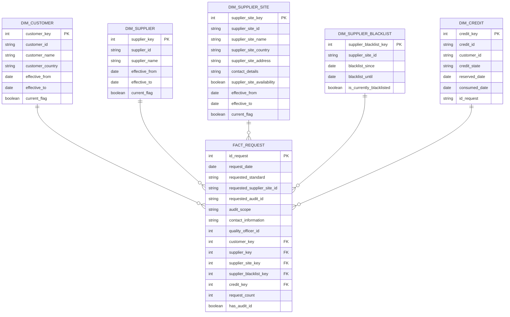

## OLAP ER

```mermaid
erDiagram
    %% Big Fact table
    FACT_REQUEST {
        int id_request PK
        date request_date
        string requested_standard
        string requested_supplier_site_id
        string requested_audit_id
        string audit_scope
        string contact_information
        int quality_officer_id
        int customer_key FK
        int supplier_key FK
        int supplier_site_key FK
        int supplier_blacklist_key FK
        int credit_key FK
        int request_count
        boolean has_audit_id
    }

    %% Dimensions
    DIM_CUSTOMER {
        int customer_key PK
        string customer_id
        string customer_name
        string customer_country
        date effective_from
        date effective_to
        boolean current_flag
    }

    DIM_SUPPLIER {
        int supplier_key PK
        string supplier_id
        string supplier_name
        date effective_from
        date effective_to
        boolean current_flag
    }

    DIM_SUPPLIER_SITE {
        int supplier_site_key PK
        string supplier_site_id
        string supplier_site_name
        string supplier_site_country
        string supplier_site_address
        string contact_details
        boolean supplier_site_availability
        date effective_from
        date effective_to
        boolean current_flag
    }

    DIM_SUPPLIER_BLACKLIST {
        int supplier_blacklist_key PK
        string supplier_site_id
        date blacklist_since
        date blacklist_until
        boolean is_currently_blacklisted
    }

    DIM_CREDIT {
        int credit_key PK
        string credit_id
        string customer_id
        string credit_state
        date reserved_date
        date consumed_date
        string id_request
    }

    %% Relationships
    DIM_CUSTOMER ||--o{ FACT_REQUEST : ""
    DIM_SUPPLIER ||--o{ FACT_REQUEST : ""
    DIM_SUPPLIER_SITE ||--o{ FACT_REQUEST : ""
    DIM_SUPPLIER_BLACKLIST ||--o{ FACT_REQUEST : ""
    DIM_CREDIT ||--o{ FACT_REQUEST : ""

```
